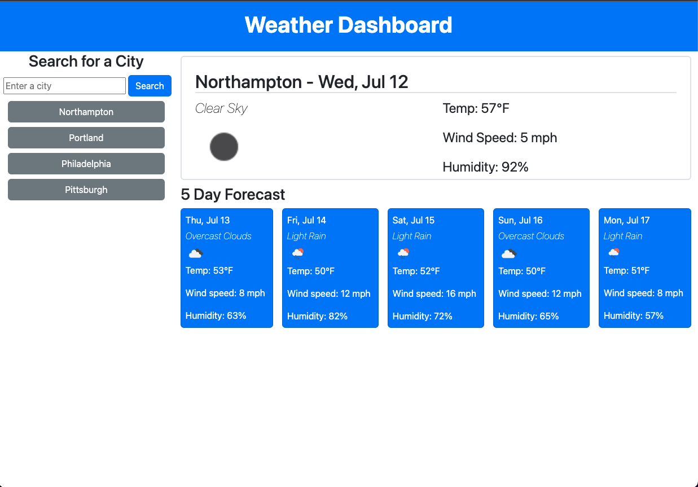

# weather-dashboard

## Description

The goal of this project is to create a weather dashboard that can show the current weather conditions as well as the five day forecast for a given location. 

This project utilizes several API calls, as well as local storage, to turn a given address into latitude and longitude coordinates, which are in turn passed to the OpenWeatherMap API to get the forecast.

The dashboard saves the user's previous searches, and presents them as buttons so that it is easy to search for the weather conditions of those locations again. 

## Installation

The app is deployed at this address: [https://lucygouvin.github.io/weather-dashboard/](https://lucygouvin.github.io/weather-dashboard/)

## Usage

When you load the page, it should automatically show the current and future forecast for your last searched location. If there is no last searched location, it will show a message prompting the user to search for a city. 

When you search a city in the search bar, it will display the current and future forecast for that location. It will also save that location to the localStorage, and create a button in the search history section.

If you click on one of those history buttons, it will display the current and future forecast for that location again. 

## Credits

N/A

## License

Please refer to the license in this repository.

